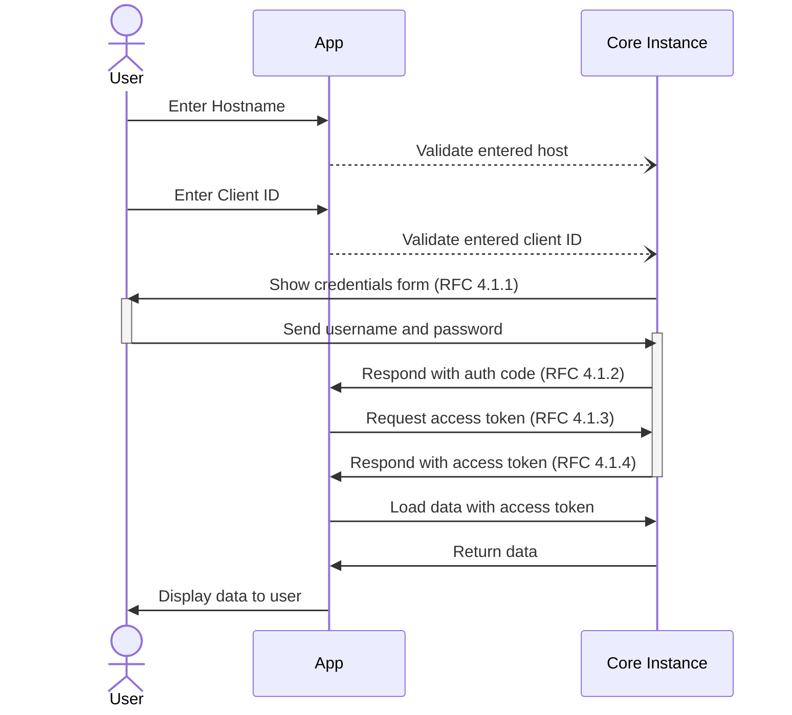
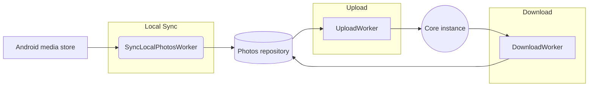

# Photos.network

[](./LICENSE.md)
[](https://github.com/photos-network/android/graphs/contributors)
[](https://discord.gg/dGFDpmWp46)
[](https://github.com/photos-network/android/actions/workflows/continuous-delivery-pipeline.yml)


[Photos.network](https://photos.network) is an open source project for self hosted photo management.
Its core features are:

- Share photos with friends, family or public
- Filter / Search photos by attributes like location or date
- Group photos by objects like people of objects

## App workflow
To connect the app to a [core instance](https://github.com/photos-network/core), 
the user needs to authenticate itself via [Authorization Code Grant](https://www.oauth.com/oauth2-servers/server-side-apps/authorization-code/) in [OAuth 2.0](https://datatracker.ietf.org/doc/html/rfc6749).

After adding the **Host** and **Client ID** into the app, the app will construct the request URI
and display it in a browser window so the user can enter its credentials.


The synchronisation of photos with a core instance is done in multiple steps:


## Gitflow
- *main:* contains production code
- *development:* latest changes that will be included in the next release
- *feature/:* each feature separated until it is done and merged back to development
- *release/:* signifies an upcoming release and will be merged into main
- *hotfix/:* urgent changes to be merged into release and development

## Continuous Delivery Pipeline
The whole pipeline is automated into Github workflows.

- Code checks to enforce code quality & style
- Tests to ensure a stable and release-ready codebase
- Deployment into a preview environment
- Release to production

## Contribution
The help of the community is essential for projects like this. Users have different requirements and perspectives how their instances should work.

### Getting Started

Create a Feature request with a short but understandable description what the feature should look like and how the user can use it.

### Making Changes

* Create a `/feature/<topic>` branch from where you want to base your work.
  * This is usually the `development` branch.
  * Only target `release` branches if you are certain your fix must be on that branch.
* Make commits of logical and atomic units.
* Check for unnecessary whitespace with `git diff --check` before committing.
* Make sure your commit messages are in the proper format. Start the first
  line of the commit with the issue number in parentheses.
* run tests and code quality checks locally ```./gradlew detekt lint testDebugUnitTest connectedAndroidTest```
