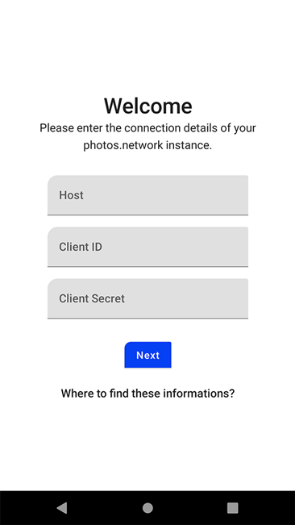

# Photos.network

[Photos.network](https://photos.network) is an open source project for self hosted photo management.
Its core features are:

- Share photos with friends, family or public
- Filter / Search photos by attributes like location or date
- Group photos by objects like people of objects

## Android

This repository contains the official android client of the project.

## Screens

